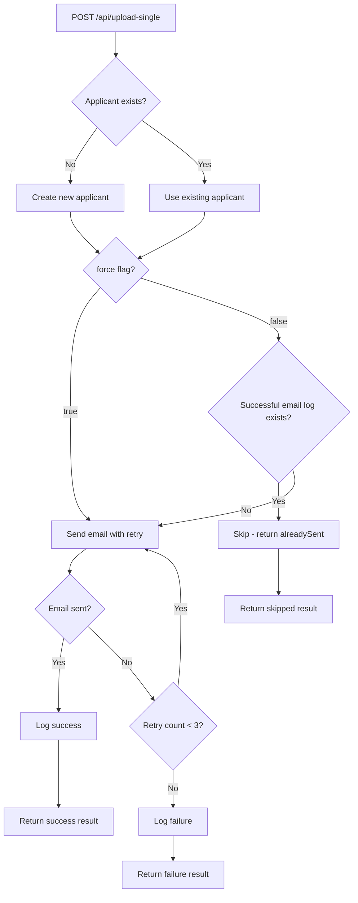

# Backend Fixes Implementation Plan

## Overview
Replace the bulk upload endpoint with a single applicant upload endpoint. Handle both new and existing applicants, with email deduplication logic, retry mechanism, and an optional force flag.

---

## Changes Required

### 1. Add new method to `EmailLogsService` ([`src/services/email-logs.service.ts`](../src/services/email-logs.service.ts))

Add a method to check if an applicant has a successful email log for a specific template:

```typescript
async hasSuccessfulEmailLog(applicantId: string, templateName: string): Promise<boolean> {
  try {
    const log = await prisma.emailLogs.findFirst({
      where: {
        applicantId,
        templateName,
        status: 'success'
      }
    });
    return log !== null;
  } catch (error) {
    emailLogsLogger.error(`Failed to check email log: ${error instanceof Error ? error.message : String(error)}`);
    throw error;
  }
}
```

---

### 2. Replace `/api/upload` with `/api/upload-single` in [`src/server/index.ts`](../src/server/index.ts)

#### New endpoint logic:



#### Request body structure:
```typescript
{
  data: {
    Name: string;
    email: string;
    'job title'?: string;
    phone?: string;
    country?: string;
  };
  templateName: string;
  force?: boolean; // Optional, defaults to false
  country?: string; // Optional country override
}
```

#### Response structure:
```typescript
{
  success: boolean;
  message: string;
  applicantId: string;
  applicantEmail: string;
  action: 'created' | 'existing' | 'skipped';
  emailResult: {
    sent: boolean;
    skipped: boolean;
    reason?: string;
    retryCount?: number;
  }
}
```

#### Logic flow:
1. Validate required fields (Name, email)
2. Check if applicant exists by email
3. If not exists → create new applicant with country from request, action = 'created'
4. If exists → use existing applicant, action = 'existing'
5. Check `force` flag:
   - If `force = true` → skip success check, send email with retry
   - If `force = false` → check for successful email log with same template
     - If exists → skip sending, return action = 'skipped', reason = 'already sent'
     - If not exists → send email with retry
6. Send email with retry logic (up to 3 attempts)
7. Log result (success or failure)
8. Return response with retry count

#### Retry logic:
- Retry up to 3 times if email sending fails
- Log each retry attempt
- Include retry count in response

---

### 3. Update CLI [`src/cli/excel-import.ts`](../src/cli/excel-import.ts)

#### Changes:
- Remove the bulk `/api/upload` call
- Loop through each applicant and call `/api/upload-single` individually
- Add `--country` flag (required) to assign country to all applicants
- Add `--force` flag to force resend emails
- Show real-time progress for each email including retry status

#### CLI command options:
```bash
excel-import process -f <file> -t <template> -c <country> [--force] [--dry-run]
```

#### Options:
- `-f, --file <path>` - Path to Excel file (required)
- `-t, --template-name <name>` - Name of the email template to use (required)
- `-c, --country <country>` - Country to assign to all applicants (required)
- `--force` - Force resend emails even if already sent
- `--dry-run` - Parse and preview without sending to server
- `-u, --url <url>` - Express endpoint URL (default: http://localhost:3000/api/upload-single)

#### Real-time progress display:
```
[1/10] Processing john@example.com...
  ✓ Applicant created
  ✓ Email sent successfully

[2/10] Processing jane@example.com...
  ℹ Applicant already exists
  ✓ Email sent successfully

[3/10] Processing bob@example.com...
  ℹ Applicant already exists
  ⊘ Email skipped (already sent with this template)

[4/10] Processing alice@example.com...
  ✗ Email failed: SMTP error
  ↻ Retrying (1/3)...
  ✗ Email failed: SMTP error
  ↻ Retrying (2/3)...
  ✗ Email failed: SMTP error
  ↻ Retrying (3/3)...
  ✗ Email failed after 3 attempts: SMTP error

[5/10] Processing charlie@example.com (force mode)...
  ℹ Applicant already exists
  ✓ Email sent successfully (force resend)
```

#### Country assignment:
- The `--country` flag value will be assigned to all applicants
- If the Excel file already has a country column, it will be overridden by the CLI flag
- This ensures all applicants have a consistent country value

---

### 4. Remove old bulk upload endpoint

Delete the old `/api/upload` endpoint from [`src/server/index.ts`](../src/server/index.ts) as it's being replaced by `/api/upload-single`.

---

## Files to Modify

1. [`src/services/email-logs.service.ts`](../src/services/email-logs.service.ts) - Add `hasSuccessfulEmailLog()` method
2. [`src/server/index.ts`](../src/server/index.ts) - Replace `/api/upload` with `/api/upload-single`
3. [`src/cli/excel-import.ts`](../src/cli/excel-import.ts) - Update to use single upload with real-time progress

---

## Example CLI Output

```
Excel Import CLI
================
Reading Excel file: /path/to/applicants.xlsx
Found sheet: Sheet1
Parsed 10 rows from Excel file
Valid rows: 10
Country: United States

Preview of valid rows:
  1. John Doe (john@example.com) - Developer
  2. Jane Smith (jane@example.com) - Designer
  3. Bob Wilson (bob@example.com)
  4. Alice Brown (alice@example.com) - Manager
  ... and 6 more rows

Sending data to Express endpoint
================================
URL: http://localhost:3000/api/upload-single
Template: welcome
Country: United States

[1/10] Processing john@example.com...
  ✓ Applicant created
  ✓ Email sent successfully

[2/10] Processing jane@example.com...
  ℹ Applicant already exists
  ✓ Email sent successfully

[3/10] Processing bob@example.com...
  ℹ Applicant already exists
  ⊘ Email skipped (already sent with this template)

[4/10] Processing alice@example.com...
  ✓ Applicant created
  ✗ Email failed: SMTP error
  ↻ Retrying (1/3)...
  ✓ Email sent successfully

[5/10] Processing charlie@example.com...
  ✓ Applicant created
  ✓ Email sent successfully

...

Server Response Summary
=======================
Total rows: 10
New applicants: 5
Existing applicants: 3
Invalid rows: 0
Emails sent: 4
Emails skipped: 1
Emails failed: 1
```

---

## Implementation Todo List

1. [x] Add `hasSuccessfulEmailLog()` method to `EmailLogsService` in [`src/services/email-logs.service.ts`](../src/services/email-logs.service.ts)
2. [x] Remove old `/api/upload` endpoint from [`src/server/index.ts`](../src/server/index.ts)
3. [x] Create new `/api/upload-single` endpoint in [`src/server/index.ts`](../src/server/index.ts) with:
   - Applicant existence check
   - Country assignment
   - Force flag handling
   - Successful email log check
   - Retry logic (up to 3 attempts)
   - Proper response structure
4. [x] Update CLI [`src/cli/excel-import.ts`](../src/cli/excel-import.ts):
   - Add `--country` flag (required)
   - Add `--force` flag
   - Remove bulk upload call
   - Implement single applicant upload loop
   - Add real-time progress display with retry status
   - Update summary statistics
5. [ ] Test the implementation with various scenarios:
   - New applicant
   - Existing applicant without email sent
   - Existing applicant with email already sent
   - Force resend scenario
   - Retry scenario
   - Country assignment
