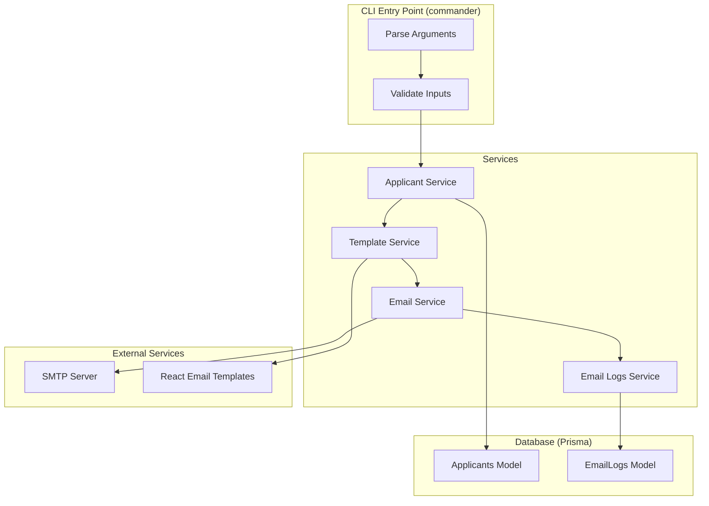

# CLI Email Sender - Implementation Plan

## Overview
A CLI program that sends emails to applicants using nodemailer and React Email templates. The program tracks email logs in database and supports retry logic for failed emails. Includes Excel import functionality with deduplication.

## Architecture



## Email Sending Flow


## Directory Structure

```
crypto-email/
├── prisma/
│   └── schema.prisma
├── src/
│   ├── cli/
│   │   ├── index.ts           # CLI entry point for sending emails
│   │   └── excel-import.ts   # CLI entry point for Excel import
│   ├── server/
│   │   └── index.ts           # Express server for Excel upload
│   ├── services/
│   │   ├── applicant.service.ts
│   │   ├── email.service.ts     # Nodemailer configuration
│   │   ├── template.service.ts  # React Email rendering
│   │   ├── email-logs.service.ts
│   │   └── email-sender.service.ts
│   ├── templates/
│   │   ├── index.ts           # Template registration
│   │   └── welcome.tsx        # React Email components
│   ├── types/
│   │   └── email.types.ts
│   ├── utils/
│   │   └── logger.ts
│   └── lib/
│       └── prisma.ts
├── sheets/
│   └── sample-applicants.xlsx # Sample Excel file
├── scripts/
│   ├── seed-applicants.ts
│   └── create-sample-excel.ts
├── .env
├── .env.example
├── package.json
└── tsconfig.json
```

## Database Schema

### EmailLogs Model
```prisma
model EmailLogs {
  id            String   @id @default(uuid())
  applicantId   String
  applicant     Applicants @relation(fields: [applicantId], references: [id], onDelete: Cascade)
  templateName  String
  sentAt        DateTime @default(now())
  status        String   // 'success' | 'failed'
  errorMessage  String?
  emailSubject  String
  emailBody     String   @db.Text
  retryCount    Int      @default(0)

  @@index([applicantId])
  @@index([templateName])
  @@index([sentAt])
}
```

### Applicants Model (Updated)
```prisma
model Applicants {
  id         String     @id @default(uuid())
  full_name  String     // Changed from first_name + last_name
  email      String     @unique
  phone      String?
  country    String?
  job_title  String?
  emailLogs  EmailLogs[]
}
```

## CLI Usage

### Send Emails (Original CLI)
```bash
# Send emails to first 10 applicants
npm run send-emails -- -l 10 -t welcome

# Send emails to first 5 applicants from Canada
npm run send-emails -- -l 5 -t welcome -c Canada

# Dry run to preview
npm run send-emails -- -l 10 -t welcome --dry-run
```

### Import from Excel (New Feature)
```bash
# Create sample Excel file
npm run create-sample-excel

# Import from Excel (dry run)
npx tsx src/cli/excel-import.ts process -f sheets/sample-applicants.xlsx -t welcome --dry-run

# Import from Excel (send emails)
npx tsx src/cli/excel-import.ts process -f sheets/sample-applicants.xlsx -t welcome

#Alternative Command
npm run excel-import -- process -f sheets/<name of the excel file> -t <template>        
   
# Start Express server (required for Excel import)
npm run server
```

## CLI Options

### Send Emails Command
| Option | Short | Description | Required |
|--------|-------|-------------|----------|
| --limit | -l | Maximum number of applicants to send emails to | Yes |
| --template-name | -t | Name of the email template to use | Yes |
| --country | -c | Filter applicants by country (optional) | No |
| --dry-run | N/A | Preview without sending actual emails | No |

### Excel Import Command
| Option | Short | Description | Required |
|--------|-------|-------------|----------|
| --file | -f | Path to Excel file | Yes |
| --template-name | -t | Name of the email template to use | Yes |
| --url | -u | Express endpoint URL (default: http://localhost:3000/api/upload) | No |
| --dry-run | N/A | Preview without sending to server | No |

## Environment Variables

```env
# Database
DATABASE_URL="file:./dev.db"

# SMTP Configuration
SMTP_HOST="smtp.example.com"
SMTP_PORT="587"
SMTP_SECURE="false"
SMTP_USER="your-email@example.com"
SMTP_PASSWORD="your-password"
SMTP_FROM="noreply@example.com"
SMTP_FROM_NAME="Crypto Email"

# Optional: Express Server Port
PORT="3000"
```

## Excel File Format

| Column | Required | Description |
|--------|----------|-------------|
| Name | Yes | Full name of applicant |
| email | Yes | Email address |
| job title | No | Job title |
| phone | No | Phone number |
| country | No | Country |

## Required Packages

```json
{
  "dependencies": {
    "@prisma/client": "",
    "@react-email/components": "",
    "@react-email/render": "",
    "commander": "",
    "dotenv": "",
    "express": "",
    "nodemailer": "",
    "xlsx": ""
  },
  "devDependencies": {
    "@types/express": "",
    "@types/nodemailer": "",
    "prisma": "",
    "tsx": ""
  }
}
```

## Key Implementation Details

### 1. Email Service
- Configures nodemailer transport using environment variables
- Provides sendEmail function with retry logic
- Returns success/failure status

### 2. Template Service
- Uses React Email to render templates
- Accepts template name and data (fullName, email)
- Returns HTML string and subject

### 3. Email Logs Service
- Creates log entries for each email attempt
- Updates retry count on retries
- Tracks final status (success/failed)

### 4. Retry Logic
- Max 3 retries per email
- Exponential backoff between retries
- Logs each attempt

### 5. Dry Run Mode
- Fetches and filters applicants
- Renders templates
- Displays preview without sending
- No database writes

### 6. Excel Import Feature
- Reads Excel files using xlsx library
- Parses Name, email, job title, phone, country columns
- Sends data to Express endpoint
- Supports deduplication (checks existing emails)
- Optional phone and country columns

### 7. Deduplication Logic
- Checks database for existing email before creating new applicant
- Skips duplicate emails during import
- Reports count of duplicates skipped

### 8. Express Server
- Receives Excel data via POST /api/upload
- Validates data and checks for duplicates
- Saves new applicants to database
- Sends emails to new applicants
- Returns detailed summary

## Error Handling

- Invalid template name → Display error and exit
- No applicants found → Display message and exit
- SMTP connection error → Log and continue with next applicant
- Template rendering error → Log and continue with next applicant
- Database error → Display error and exit
- Invalid Excel data → Report and skip row
- Duplicate email → Skip and report

## Testing Checklist

- [x] CLI parses arguments correctly
- [x] Dry-run mode displays correct preview
- [x] Template renders with applicant data
- [x] Email sends successfully via SMTP
- [x] Email log is created in database
- [x] Retry logic works on failures
- [x] Country filter works correctly
- [x] Limit parameter works correctly
- [x] Multiple emails can be sent to same applicant
- [x] Error messages are clear and helpful
- [x] Excel file parsing works correctly
- [x] Deduplication logic prevents duplicate emails
- [x] Phone and country columns are supported
- [x] Express server receives and processes Excel data

## Future Enhancements

- Add more email templates
- Add list-templates command
- Support for email attachments
- Bulk email import from CSV
- Email statistics/reporting command
- Webhook notifications for email events
- Support for multiple Excel sheets
- Email scheduling feature
