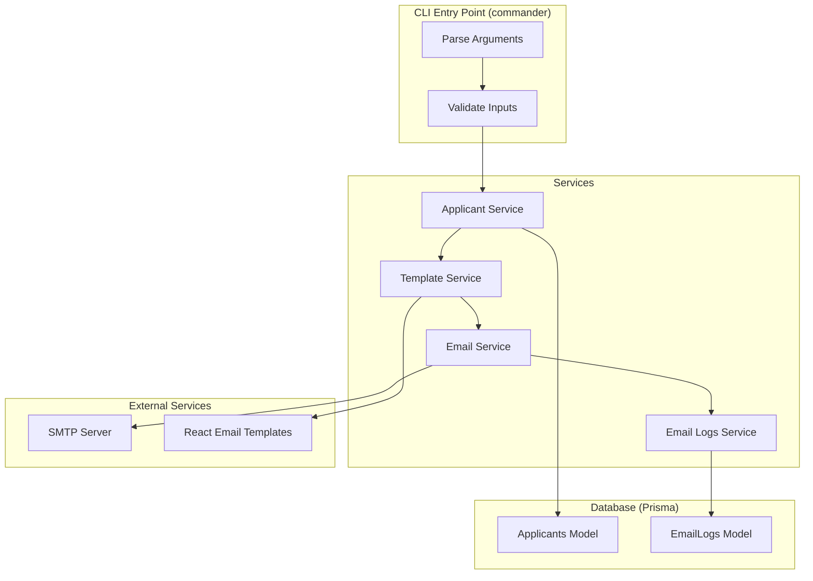
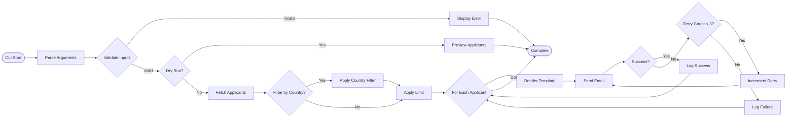

# CLI Email Sender - Implementation Plan

## Overview
A CLI program that sends emails to applicants using nodemailer and React Email templates. The program tracks email logs in the database and supports retry logic for failed emails.

## Architecture



## Email Sending Flow



## Directory Structure

```
crypto-email/
├── prisma/
│   └── schema.prisma
├── src/
│   ├── cli/
│   │   └── index.ts           # CLI entry point with commander
│   ├── services/
│   │   ├── applicant.service.ts
│   │   ├── email.service.ts   # Nodemailer configuration
│   │   ├── template.service.ts # React Email rendering
│   │   └── email-logs.service.ts
│   ├── templates/
│   │   └── [template-name].tsx # React Email components
│   ├── types/
│   │   └── email.types.ts
│   ├── utils/
│   │   └── logger.ts
│   └── index.ts
├── .env
├── .env.example
├── package.json
└── tsconfig.json
```

## Database Schema

### EmailLogs Model
```prisma
model EmailLogs {
  id            String   @id @default(uuid())
  applicantId   String
  applicant     Applicants @relation(fields: [applicantId], references: [id])
  templateName  String
  sentAt        DateTime @default(now())
  status        String   // 'success' | 'failed'
  errorMessage  String?
  emailSubject  String
  emailBody     String   @db.Text
  retryCount    Int      @default(0)

  @@index([applicantId])
  @@index([templateName])
  @@index([sentAt])
}
```

### Updated Applicants Model
```prisma
model Applicants {
  id         String     @id @default(uuid())
  first_name String
  last_name  String
  email      String     @unique
  phone      String?
  country    String?
  emailLogs  EmailLogs[]
}
```

## CLI Usage

```bash
# Send emails to first 10 applicants
npm run send-emails -- -l 10 -t welcome

# Send emails to first 5 applicants from Canada
npm run send-emails -- -l 5 -t welcome -c Canada

# Dry run to preview
npm run send-emails -- -l 10 -t welcome --dry-run
```

## CLI Options

| Option | Short | Description | Required |
|--------|-------|-------------|----------|
| --limit | -l | Maximum number of applicants to send emails to | Yes |
| --template-name | -t | Name of the email template to use | Yes |
| --country | -c | Filter applicants by country (optional) | No |
| --dry-run | N/A | Preview without sending actual emails | No |

## Environment Variables

```env
# Database
DATABASE_URL="prisma+postgres://..."

# SMTP Configuration
SMTP_HOST="smtp.example.com"
SMTP_PORT="587"
SMTP_USER="your-email@example.com"
SMTP_PASSWORD="your-password"
SMTP_FROM="noreply@example.com"
SMTP_FROM_NAME="Crypto Email"

# Optional: Enable TLS
SMTP_SECURE="false"
```

## Required Packages

```json
{
  "dependencies": {
    "@react-email/components": "^",
    "@react-email/render": "",
    "commander": "",
    "dotenv": "",
    "nodemailer": "",
    "prisma": "",
    "@prisma/client": ""
  },
  "devDependencies": {
    "@types/nodemailer": "",
    "tsx": ""
  }
}
```

## Key Implementation Details

### 1. Email Service
- Configures nodemailer transport using environment variables
- Provides sendEmail function with retry logic
- Returns success/failure status

### 2. Template Service
- Uses React Email to render templates
- Accepts template name and data
- Returns HTML string and subject

### 3. Email Logs Service
- Creates log entries for each email attempt
- Updates retry count on retries
- Tracks final status (success/failed)

### 4. Retry Logic
- Max 3 retries per email
- Exponential backoff between retries
- Logs each attempt

### 5. Dry Run Mode
- Fetches and filters applicants
- Renders templates
- Displays preview without sending
- No database writes

## Error Handling

- Invalid template name → Display error and exit
- No applicants found → Display message and exit
- SMTP connection error → Log and continue with next applicant
- Template rendering error → Log and continue with next applicant
- Database error → Display error and exit

## Testing Checklist

- [ ] CLI parses arguments correctly
- [ ] Dry-run mode displays correct preview
- [ ] Template renders with applicant data
- [ ] Email sends successfully via SMTP
- [ ] Email log is created in database
- [ ] Retry logic works on failures
- [ ] Country filter works correctly
- [ ] Limit parameter works correctly
- [ ] Multiple emails can be sent to same applicant
- [ ] Error messages are clear and helpful

## Future Enhancements

- Add more email templates
- Add list-templates command
- Support for email attachments
- Bulk email import from CSV
- Email statistics/reporting command
- Webhook notifications for email events
