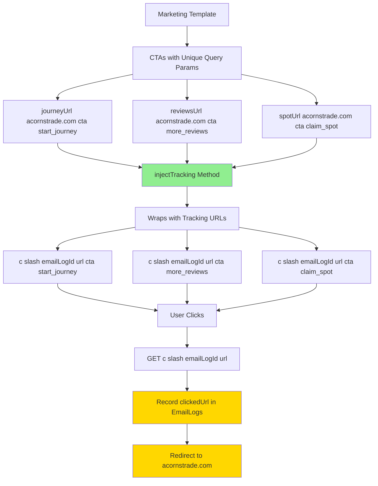

# Email Tracking Implementation Plan

## Overview
This plan outlines the implementation of unique tracking URLs for each CTA in the marketing email. All CTAs will point to `https://acornstrade.com` with unique query parameters to distinguish which CTA was clicked, while the `injectTracking` method handles all URL wrapping automatically.

## Current State Analysis

### Existing Infrastructure
- **Open Tracking**: `/t/open/:emailLogId` endpoint returns 1x1 transparent pixel
- **Click Tracking**: `/c/:emailLogId?url=<encodedUrl>` endpoint records clicks and redirects
- **Schema**: `EmailLogs` model already has tracking fields (`openedAt`, `clickedAt`, `clickedUrl`, etc.)
- **Template**: Marketing email has 3 CTAs using `ctaUrl` and `moreReviewsUrl` props
- **injectTracking**: Automatically wraps all links (except mailto and unsubscribe) with tracking URLs

### Current injectTracking Logic
```typescript
// Replaces all links except mailto and unsubscribe
const linkRegex = /href=["']((?!mailto:|\/api\/unsubscribe\/)[^"']+)["']/g;
trackedHtml = trackedHtml.replace(linkRegex, (match, url) => {
  const encodedUrl = encodeURIComponent(url);
  return `href="${trackingClickSubdomain}/c/${emailLogId}?url=${encodedUrl}"`;
});
```

## Implementation Plan

### 1. Update Marketing Template (`src/templates/marketing.tsx`)

**Update the interface to accept unique URL props with creative names:**

```typescript
interface MarketingEmailProps {
    fullName: string;
    email: string;
    reviews?: MarketingReview[];
    baseUrl: string;
    journeyUrl: string;      // NEW: https://acornstrade.com?cta=start_journey
    reviewsUrl: string;      // NEW: https://acornstrade.com?cta=more_reviews
    spotUrl: string;         // NEW: https://acornstrade.com?cta=claim_spot
    unsubscribeUrl?: string;
    deadlineDate?: string;
}
```

**Update button href attributes to use unique URLs:**

```typescript
// Line 134 - "Start Your Journey Today" button
<Button style={hookCtaButton} href={journeyUrl}>
    Start Your Journey Today
</Button>

// Line 163 - "See More Reviews" button
<Button style={secondaryButton} href={reviewsUrl}>
    See More Reviews
</Button>

// Line 182 - "Claim Your Spot Now" button
<Button style={ctaButton} href={spotUrl}>
    Claim Your Spot Now
</Button>
```

**Update PreviewProps:**

```typescript
MarketingEmail.PreviewProps = {
    fullName: 'John Doe',
    email: 'john.doe@example.com',
    baseUrl: BASE_URL ? BASE_URL : 'https://acornstrade.com',
    journeyUrl: 'https://acornstrade.com?cta=start_journey',      // NEW
    reviewsUrl: 'https://acornstrade.com?cta=more_reviews',        // NEW
    spotUrl: 'https://acornstrade.com?cta=claim_spot',             // NEW
    unsubscribeUrl: 'https://acornstrade.com/unsubscribe',
} as MarketingEmailProps;
```

### 2. Update Template Registration (`src/templates/index.ts`)

**Update marketing template registration to pass the new URL props:**

```typescript
// Register marketing template (Acorns Trade email)
templateService.registerTemplate('marketing', (data) => ({
  subject: 'Build Your Financial Independence - Limited Spots Available',
  component: MarketingEmail({
    fullName: data.fullName,
    email: data.email,
    reviews: data.reviews as MarketingReview[] | undefined,
    baseUrl: data.baseUrl || 'https://acornstrade.com',
    journeyUrl: data.journeyUrl || 'https://acornstrade.com?cta=start_journey',      // NEW
    reviewsUrl: data.reviewsUrl || 'https://acornstrade.com?cta=more_reviews',        // NEW
    spotUrl: data.spotUrl || 'https://acornstrade.com?cta=claim_spot',               // NEW
    unsubscribeUrl: data.unsubscribeUrl,
    deadlineDate: data.deadlineDate,
  }),
}));
```

### 3. Verify injectTracking Handles URLs Correctly

The existing `injectTracking` method in `src/services/email-sender.service.ts` already:
1. Injects the tracking pixel for open tracking
2. Wraps all links (except mailto and unsubscribe) with tracking URLs
3. Preserves the original URL in the `url` query parameter

**No changes needed to injectTracking** - it will automatically wrap the URLs with tracking.

### 4. Verify Server Endpoint Records Clicked URL

The existing click tracking endpoint in `src/server/index.ts` already:
1. Receives the `url` query parameter
2. Records it in the `clickedUrl` field of `EmailLogs`
3. Redirects to `https://acornstrade.com/`

**No changes needed** - the `clickedUrl` field will store the full URL including the `cta` parameter, allowing you to distinguish between the three CTAs.

## Architecture Diagram



## URL Mapping

| CTA Button | Template URL | Tracked URL Pattern | clickedUrl Value (Recorded) |
|------------|--------------|---------------------|-----------------------------|
| Start Your Journey Today | `https://acornstrade.com?cta=start_journey` | `/c/{emailLogId}?url=https%3A%2F%2Facornstrade.com%3Fcta%3Dstart_journey` | `https://acornstrade.com?cta=start_journey` |
| See More Reviews | `https://acornstrade.com?cta=more_reviews` | `/c/{emailLogId}?url=https%3A%2F%2Facornstrade.com%3Fcta%3Dmore_reviews` | `https://acornstrade.com?cta=more_reviews` |
| Claim Your Spot Now | `https://acornstrade.com?cta=claim_spot` | `/c/{emailLogId}?url=https%3A%2F%2Facornstrade.com%3Fcta%3Dclaim_spot` | `https://acornstrade.com?cta=claim_spot` |

## Files to Modify

1. `src/templates/marketing.tsx` - Add new URL props and update button hrefs
2. `src/templates/index.ts` - Update template registration with new URL props

## No Schema Changes Required

The existing `EmailLogs` schema already has:
- `clickedUrl` - Will store the full URL including the `cta` query parameter
- `clickedAt`, `clickCount`, `lastClickedAt`, `clickedFromIp`, `clickedFromUserAgent` - Already tracking click metadata

## Tracking Pixel

The tracking pixel is already being injected by the existing `injectTracking` method. The pixel URL is:
```
{baseUrl}/t/open/{emailLogId}.png
```

This 1x1 transparent pixel loads when the email is opened, triggering the `/t/open/:emailLogId` endpoint which records the open event.

## Testing Checklist

- [ ] Verify each CTA has a unique URL with cta query parameter in the template
- [ ] Verify injectTracking wraps each URL with tracking
- [ ] Verify clicking each CTA redirects to acornstrade.com
- [ ] Verify clickedUrl field records the specific URL with cta parameter
- [ ] Verify tracking pixel is injected correctly
- [ ] Verify open tracking still works
- [ ] Verify unsubscribe link works correctly (not wrapped with tracking)
