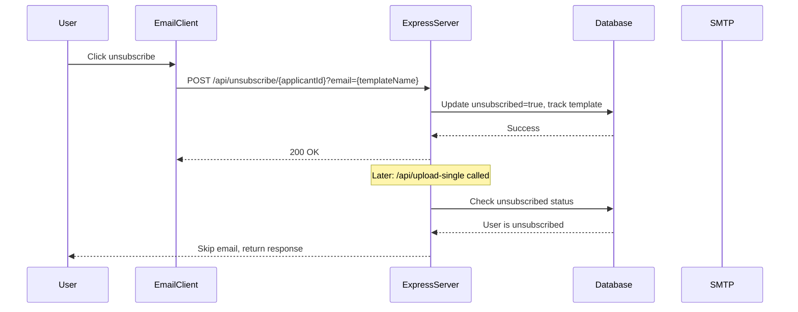

# Unsubscribe Functionality Implementation Plan

## Overview
Add RFC 8058 compliant unsubscribe headers to all emails and implement a one-click unsubscribe mechanism via Express endpoints.

## Requirements
1. Add `List-Unsubscribe` and `List-Unsubscribe-Post` headers to all outgoing emails
2. Create a POST endpoint to handle unsubscribe requests using applicant ID
3. Add `unsubscribed`, `unsubscribedAt`, and `unsubscribedFromEmail` fields to track users who have unsubscribed
4. Filter out unsubscribed users when sending emails via `/upload-single` endpoint

## Architecture Diagram



## Implementation Steps

### 1. Database Schema Changes
**File:** `prisma/schema.prisma`

Add unsubscribe tracking fields to `Applicants` model:
```prisma
model Applicants {
  id                    String     @id @default(uuid())
  full_name             String
  email                 String     @unique
  phone                 String?
  country               String?
  job_title             String?
  unsubscribed          Boolean    @default(false)
  unsubscribedAt        DateTime?
  unsubscribedFromEmail String?    // Track which email template caused unsubscribe
  emailLogs             EmailLogs[]
}
```

Create migration:
```bash
npx prisma migrate dev --name add_unsubscribe_tracking
```

### 2. Type Definitions
**File:** `src/types/email.types.ts`

Add new types for unsubscribe functionality:
```typescript
export interface UnsubscribeResponse {
  success: boolean;
  message: string;
}

export interface EmailHeaders {
  'List-Unsubscribe': string;
  'List-Unsubscribe-Post': string;
}
```

### 3. Update Email Service
**File:** `src/services/email.service.ts`

Modify `sendEmail` method to accept and include unsubscribe headers:
```typescript
export interface SendEmailOptions {
  to: string;
  subject: string;
  html: string;
  unsubscribeUrl?: string;
}

async sendEmail(options: SendEmailOptions): Promise<EmailSendResult> {
  const headers: Record<string, string> = {};

  if (options.unsubscribeUrl) {
    headers['List-Unsubscribe'] = `<${options.unsubscribeUrl}>`;
    headers['List-Unsubscribe-Post'] = 'List-Unsubscribe=One-Click';
  }

  const mailOptions = {
    from: `"${this.fromName}" <${this.fromAddress}>`,
    to: options.to,
    subject: options.subject,
    html: options.html,
    headers,
  };

  // ... rest of implementation
}
```

### 4. Update Email Sender Service
**File:** `src/services/email-sender.service.ts`

Generate unsubscribe URL using applicant ID and template name:
```typescript
async sendEmailToApplicant(
  applicant: Applicants,
  templateName: string,
  dryRun: boolean = false
): Promise<EmailResult> {
  const { id, email, full_name } = applicant;

  // Generate unsubscribe URL using applicant ID and template name
  const baseUrl = process.env.BASE_URL || 'http://localhost:3000';
  const unsubscribeUrl = `${baseUrl}/api/unsubscribe/${id}?email=${encodeURIComponent(templateName)}`;

  // ... render template

  // Send email with unsubscribe URL
  const emailResult = await emailService.sendEmailWithRetry({
    to: email,
    subject,
    html,
    unsubscribeUrl,
  });

  // ... rest of implementation
}
```

### 5. Update Applicant Service
**File:** `src/services/applicant.service.ts`

Add methods to handle unsubscribe status:
```typescript
async markAsUnsubscribed(applicantId: string, emailTemplate: string): Promise<boolean> {
  try {
    await prisma.applicants.update({
      where: { id: applicantId },
      data: {
        unsubscribed: true,
        unsubscribedAt: new Date(),
        unsubscribedFromEmail: emailTemplate,
      },
    });
    applicantLogger.success(`Applicant '${applicantId}' marked as unsubscribed from '${emailTemplate}'`);
    return true;
  } catch (error) {
    applicantLogger.error(`Failed to mark applicant as unsubscribed: ${error}`);
    return false;
  }
}

async isUnsubscribed(applicantId: string): Promise<boolean> {
  const applicant = await this.getApplicantById(applicantId);
  return applicant?.unsubscribed ?? false;
}
```

### 6. Add Unsubscribe Endpoint
**File:** `src/server/index.ts`

Add new endpoint to handle unsubscribe:
```typescript
// POST /api/unsubscribe/:applicantId - Handle one-click unsubscribe
app.post('/api/unsubscribe/:applicantId', async (req: Request, res: Response) => {
  try {
    const { applicantId } = req.params;
    const { email: emailTemplate } = req.query;

    if (!applicantId) {
      return res.status(400).json({
        success: false,
        error: 'Applicant ID is required.'
      });
    }

    // Verify applicant exists
    const applicant = await applicantService.getApplicantById(applicantId);
    if (!applicant) {
      return res.status(404).json({
        success: false,
        error: 'Applicant not found.'
      });
    }

    const success = await applicantService.markAsUnsubscribed(
      applicantId,
      typeof emailTemplate === 'string' ? emailTemplate : 'unknown'
    );

    if (success) {
      logger.success(`Unsubscribed applicant: ${applicant.email} from email: ${emailTemplate || 'unknown'}`);
      return res.json({
        success: true,
        message: 'You have been successfully unsubscribed.'
      });
    } else {
      return res.status(500).json({
        success: false,
        error: 'Failed to process unsubscribe request.'
      });
    }
  } catch (error) {
    logger.error(`Error processing unsubscribe: ${error}`);
    res.status(500).json({
      success: false,
      error: 'Internal server error'
    });
  }
});

// GET /api/unsubscribe/:applicantId - For GET requests (fallback)
app.get('/api/unsubscribe/:applicantId', async (req: Request, res: Response) => {
  try {
    const { applicantId } = req.params;
    const { email: emailTemplate } = req.query;

    if (!applicantId) {
      return res.status(400).send('Applicant ID is required.');
    }

    const applicant = await applicantService.getApplicantById(applicantId);
    if (!applicant) {
      return res.status(404).send('Applicant not found.');
    }

    const success = await applicantService.markAsUnsubscribed(
      applicantId,
      typeof emailTemplate === 'string' ? emailTemplate : 'unknown'
    );

    if (success) {
      return res.send('You have been successfully unsubscribed.');
    } else {
      return res.status(500).send('Failed to process unsubscribe request.');
    }
  } catch (error) {
    logger.error(`Error processing unsubscribe: ${error}`);
    res.status(500).send('Internal server error');
  }
});
```

### 7. Update Upload Single Endpoint
**File:** `src/server/index.ts`

Modify `/api/upload-single` to check unsubscribe status:
```typescript
// POST /api/upload-single - Upload single applicant and send email
app.post('/api/upload-single', async (req: Request, res: Response) => {
  try {
    // ... existing validation and applicant lookup logic

    // Check if applicant is unsubscribed
    if (applicant.unsubscribed) {
      logger.info(`Applicant ${email} is unsubscribed (from: ${applicant.unsubscribedFromEmail}), skipping email`);
      return res.json({
        success: true,
        message: 'Applicant is unsubscribed',
        applicantId: applicant.id,
        applicantEmail: applicant.email,
        action: 'skipped',
        emailResult: {
          sent: false,
          skipped: true,
          reason: 'unsubscribed',
          unsubscribedFrom: applicant.unsubscribedFromEmail,
        },
      });
    }

    // ... rest of existing logic
  } catch (error) {
    // ... error handling
  }
});
```

### 8. Environment Variables
**File:** `.env.example`

Add new environment variable:
```env
# Base URL for generating unsubscribe links
BASE_URL=http://localhost:3000
```

### 9. Update CLI Email Sender (Optional but Recommended)
**File:** `src/cli/index.ts` or `src/cli/excel-import.ts`

Add unsubscribe check to CLI email sending as well to prevent sending to unsubscribed users from CLI.

## Testing Checklist

- [ ] Verify database migration runs successfully
- [ ] Verify unsubscribe URL is generated correctly with applicant ID and template name
- [ ] Verify unsubscribe headers are present in outgoing emails
- [ ] Test POST /api/unsubscribe/:applicantId endpoint with valid applicant ID
- [ ] Test POST /api/unsubscribe/:applicantId endpoint with invalid applicant ID
- [ ] Test GET /api/unsubscribe/:applicantId endpoint (fallback)
- [ ] Verify `unsubscribedFromEmail` is correctly tracked
- [ ] Verify unsubscribed users are skipped in /api/upload-single
- [ ] Verify response includes `unsubscribedFrom` field when skipping
- [ ] Test with force=true flag (should still respect unsubscribe status)
- [ ] Verify email clients recognize one-click unsubscribe
- [ ] Test special characters in template names are properly encoded/decoded

## Security Considerations

1. **HTTPS**: Ensure unsubscribe URLs use HTTPS in production
2. **Rate Limiting**: Consider adding rate limiting to unsubscribe endpoint
3. **CORS**: Configure CORS appropriately for the unsubscribe endpoint
4. **Idempotency**: The unsubscribe endpoint should handle repeated calls gracefully

## Notes

- The `List-Unsubscribe-Post: List-Unsubscribe=One-Click` header enables RFC 8058 one-click unsubscribe
- Most modern email clients (Gmail, Outlook, etc.) will show an "Unsubscribe" button in the email header
- The unsubscribe link uses the applicant's UUID directly (no JWT token needed)
- `unsubscribedFromEmail` tracks which email template caused the user to unsubscribe
- Unsubscribed users will be permanently excluded from future emails unless manually reactivated
- The template name is passed as a query parameter and URL-encoded for safety
